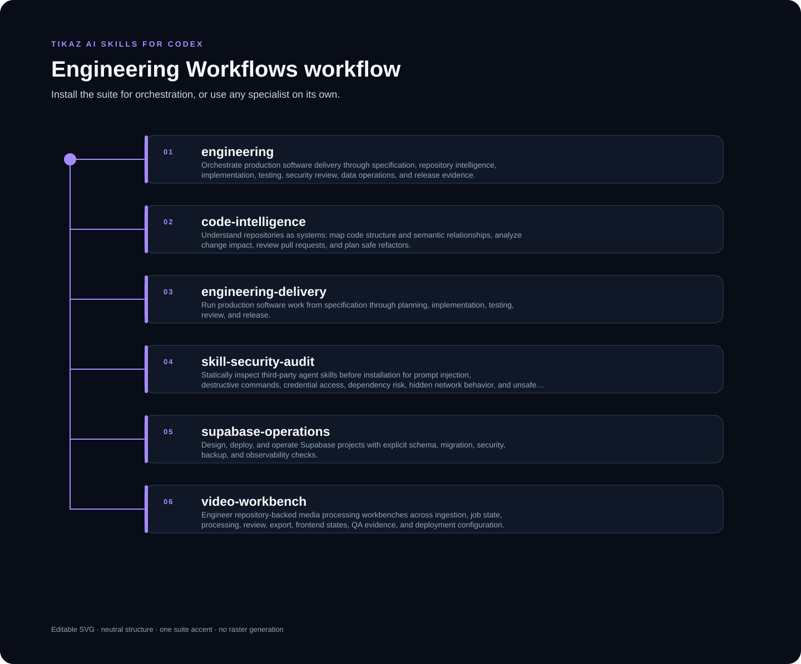

<p align="center"><a href="README.md">English</a> · <strong>简体中文</strong></p>

<p align="center"></p>

# TIKAZ Engineering Workflows for Codex

**从规格、影响分析到测试、审查和发布证据的生产级工程流程。**

由 **TIKAZ** 主导设计、整合、独立重构和持续维护。


<table data-proof-strip="true" width="100%">
<tr>
<td data-proof-cell="true" align="center" width="25%" title="规格、影响、实现、测试、审查与发布"><h3>6</h3><sub>交付阶段</sub></td>
<td data-proof-cell="true" align="center" width="25%" title="同一工作流从验收条件负责到最终交付"><h3>1</h3><sub>全生命周期责任人</sub></td>
<td data-proof-cell="true" align="center" width="25%" title="以仓库原生测试和静态检查为准"><h3>2</h3><sub>原生质量门禁</sub></td>
<td data-proof-cell="true" align="center" width="25%" title="命令、结果、风险与回滚信息保持可见"><h3>4</h3><sub>发布证据字段</sub></td>
</tr>
</table>

## 🧩 可以单独使用的 Skill

| Skill | 用途 |
|---|---|
| [`engineering`](https://tikazi.github.io/TIKAZ-AI-Skills/zh/skills/engineering/index.html) | 端到端工程编排与完成质量门 |
| [`code-intelligence`](https://tikazi.github.io/TIKAZ-AI-Skills/zh/skills/code-intelligence/index.html) | 仓库结构、语义关系、影响分析、PR 审查与重构规划 |
| [`engineering-delivery`](https://tikazi.github.io/TIKAZ-AI-Skills/zh/skills/engineering-delivery/index.html) | 规格、计划、实现、测试、复查与交付 |
| [`skill-security-audit`](https://tikazi.github.io/TIKAZ-AI-Skills/zh/skills/skill-security-audit/index.html) | 安装第三方 Skill 前的静态安全审计 |
| [`supabase-operations`](https://tikazi.github.io/TIKAZ-AI-Skills/zh/skills/supabase-operations/index.html) | Supabase 架构、迁移、RLS、备份与回滚 |
| [`video-workbench`](https://tikazi.github.io/TIKAZ-AI-Skills/zh/skills/video-workbench/index.html) | 媒体处理工作台的任务状态、处理管线、前端与部署工程 |

## 🚀 示例

```text
使用 engineering 分析这个 API 变更的影响，以小步实现并运行仓库原生测试，最后给出回滚证据。
```

## ⚠️ 限制

- 仓库本地指令与原生验证优先于通用工程规则。
- 安全审查只能降低风险，不能保证绝对安全。
- 生产部署、数据库迁移和破坏性操作需要明确授权与回滚证据。

来源与贡献边界见 [SOURCES.yml](SOURCES.yml) 与 [THIRD_PARTY_NOTICES.md](THIRD_PARTY_NOTICES.md)。

## 🌐 探索 TIKAZ 工作流家族

[🏠 AI Skills](https://github.com/TIKAZI/TIKAZ-AI-Skills) · [⚡ Context Economy](https://github.com/TIKAZI/TIKAZ-Codex-Context-Economy) · [🎨 Frontend Design](https://github.com/TIKAZI/TIKAZ-Codex-Frontend-Design) · [🎬 Video Intelligence](https://github.com/TIKAZI/TIKAZ-Codex-Video-Intelligence) · [🛠️ Engineering](https://github.com/TIKAZI/TIKAZ-Codex-Engineering) · [🔬 Research](https://github.com/TIKAZI/TIKAZ-Codex-Knowledge-Research) · [📽️ Presentation](https://github.com/TIKAZI/TIKAZ-Codex-Presentation) · [🖼️ Visual Content](https://github.com/TIKAZI/TIKAZ-Codex-Visual-Content)
